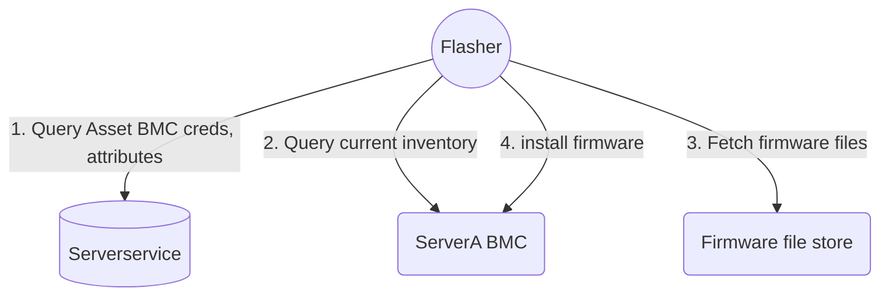

<pre>
 _______  ___      _______  _______  __   __  _______  ______
|       ||   |    |   _   ||       ||  | |  ||       ||    _ |
|    ___||   |    |  |_|  ||  _____||  |_|  ||    ___||   | ||
|   |___ |   |    |       || |_____ |       ||   |___ |   |_||_
|    ___||   |___ |       ||_____  ||       ||    ___||    __  |
|   |    |       ||   _   | _____| ||   _   ||   |___ |   |  | |
|___|    |_______||__| |__||_______||__| |__||_______||___|  |_|
</pre>

# Flasher - server fleet firmware install automation

Flasher is a vendor agnostic tool to automate firmware installs across a server fleet.

Flasher is currently limited to installing firmware `Out of band` - through the host BMC,
and expects the host BMC to be reachable to install firmware.

If the given server is powered off, it will be powered on, the firmware will be install and  powered off after.

When a firmware requires the server to be power cycled, flasher will perform
the power cycle action and poll until the firmware install is completed.

## Build

`make build-linux`

## Run

Flasher can be run in the worker mode or to one-shot install a given firmware file.

Note: it expects to be able to reach the BMC interface for the given server.

### worker command

In the worker mode `flasher worker`, flasher depends on NATS to
accept work, a secret store for BMC secrets, a firmware file store for firmware files to install.

Check out the [sandbox](https://github.com/search?q=repo%3Ametal-toolbox%2Fsandbox%20flasher&type=code) for steps to have it running along with its dependencies.

The [sandbox README.md](https://github.com/metal-toolbox/sandbox/blob/main/README.md) includes instructions to register a server, create firmware sets and install them on a server.

The diagram below depicts the services flasher depends on:


### install command

The `flasher install` command will install the given firmware file on a server,
and poll until the install is complete.


```sh
flasher install --addr 192.168.1.1 \
                --user ADMIN \
                --pass hunder2 \
                --version 3.6 \
                --component bios \
                --vendor supermicro \
                --model x11dph-t \
                --force \
                --file /tmp/BIOS_X11DPH-0981_20220208_3.6_STD.bin \
                --dry-run  \
```


see [cheatsheet.md](./docs/cheatsheet.md)


### Supported devices

For out of band updates, Flasher leverages [bmclib](https://github.com/bmc-toolbox/bmclib) and so supports firmware installs on devices that are supported by the library.

As of this writing, it supports Dell PowerEdge, Supermicro X11, X12, Asrockrack updates through their BMC.


### Documentation

Documentation on development and flasher implementation can be found in [docs](./docs/README-devel.md)
