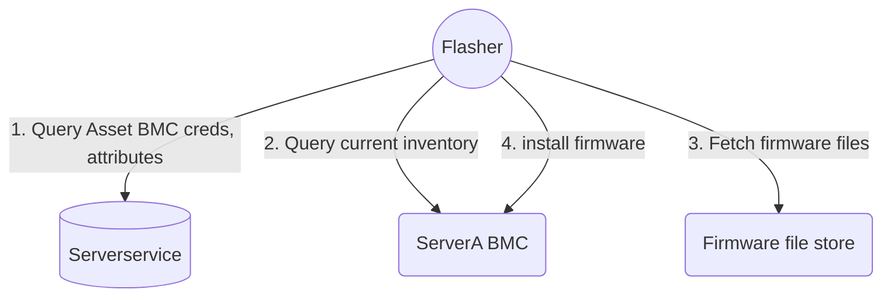

## Flasher - Server fleet firmware install automation.

Flasher is a vendor agnostic tool to automate firmware installs across a server fleet.

Flasher is currently limited to installing firmware `Out of band` - through the host BMC.

Flasher currently depends on various services to accept work and have it
completed, check out the [sandbox](https://github.com/metal-toolbox/sandbox)
for steps to have the dependencies running and install firmware on a server.

## build

`make build-linux`

## run

see [cheatsheet.md](./docs/cheatsheet.md)

## Documentation

Documentation on development and flasher implementation can be found in [docs](./docs/README-devel.md)

## Supported devices

For out of band updates, Flasher leverages [bmclib.v2](https://github.com/bmc-toolbox/bmclib/tree/v2) and supports firmware installs on all devices that bmclib.v2 supports.
