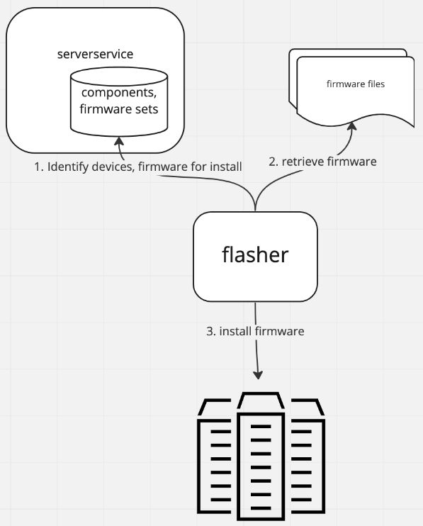

## Flasher - Server fleet firmware install automation.

Flasher is a vendor agnostic tool to automate firmware installats on a server fleet.

flasher currently supports is Out of band component firmware installs, that is - firmware installs through the server BMC.

As of this release flasher depends on serverservice for the inventory and firmware information.

 

## build

`make build-linux`

## run

see [cheatsheet.md](./docs/cheatsheet.md)

## Documentation

Documentation on development and flasher implementation can be found in [docs](./docs/README-devel.md) 

## Supported devices

For out of band updates, Flasher leverages [bmclib.v2](https://github.com/bmc-toolbox/bmclib/tree/v2) and supports firmware installs on all devices that bmclib.v2 supports.
