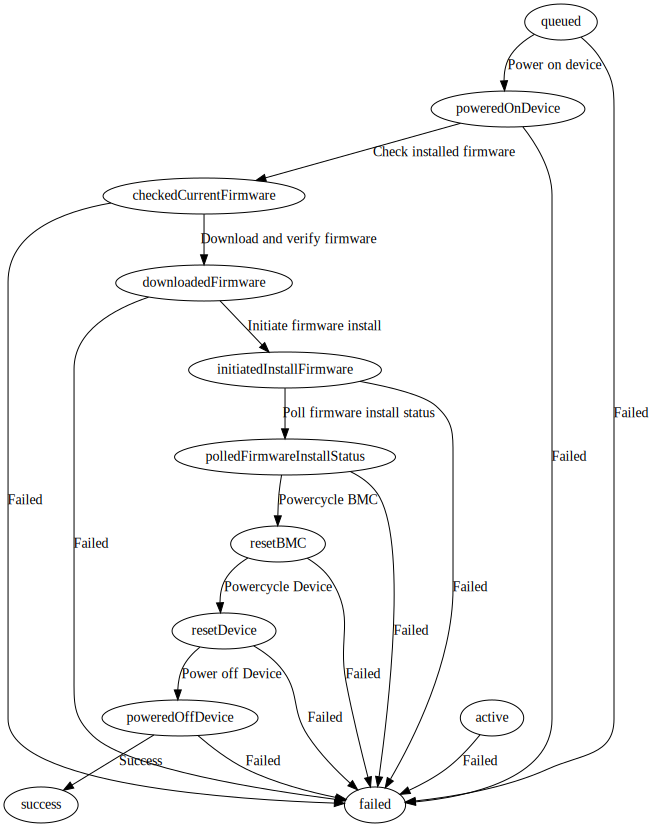

# Flasher state machine

Flasher installs firmware updates and tracks thier progress by executing a set of statemachines, this document describes those statemachines.

### Task state machine

Flasher runs a state machine for each firmware update its installing.

This *Task statemachine* transitions a task through three states - `queued`, `active`, `failed`, `success`.

 
  

The definition for the *Task statemachine* can be found [here](../internal/statemachine/task.go).

In the `active` state a task transitions through the `query`, `plan`, `run` transition handlers.

The definitions for the *Task statemachine* transition handlers can be found [here](../internal/worker/task_handlers.go).

Generated documentation for the *Task state-machine* describing the various states and transitions can be found [here](../docs/statemachine/README-task-statemachine.md)

#### The Query & Plan Transitions

These are *transition handlers* within the *Task stateachine* which carry out the following steps,

 - Query the device/inventory for current component firmware versions.
 - Identify firmware applicable for the device based on current firmware component versions.
 - Generate a an *action* plan for each component firmware applicable.

 The actions are generated as "sub-statemachines" which are then executed within the *Task statemachine* as part of the `run` transition handler.

#### The run Transition and Action sub-statemachine(s)

Each firmware to be installed is one *Action sub-statemachine* and are executed in the `run` transition handlers.

The action to install firmware band has its own *Action sub-statemachine* the definition for which can be found [here](../internal/outofband/actions.go)

The transition handlers for the *Action sub-statemachine* can be found [here](../internal/outofband/action_handlers.go)

The graph below describes the *Action sub-statemachine* flow

 
  

Generated documentation for the *Action state-machine* describing the various states and transitions can be found [here](../docs/statemachine/README-action-statemachine.md)

