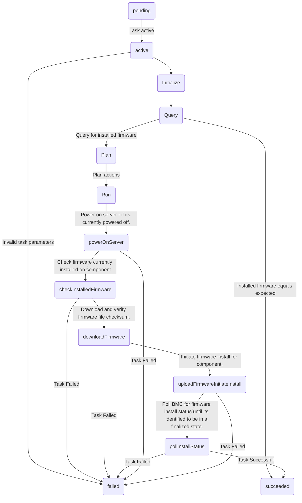

## Tasks
A **Task** represents the flasher work to install one or more firmware on a server.

Tasks may transition through four possible states,
 - **pending**
 - **queued**
 - **active**
 - **failed**
 - **succeeded**

## Actions
Flasher plans and executes an **Action** for each firmware to be installed within a **Task**.

## Steps
A **Step** is the smallest unit of work carried out by flasher as part of an **Action**.

## Flow diagram

The diagram below depicts a flow diagram for a flasher **Task** to install one firmware.

