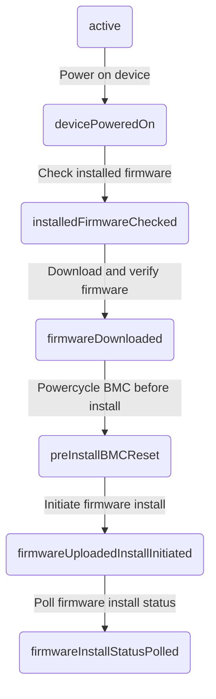

# Flasher task action sub-state machine(s)
 
The task Actions (sub-statemachines) are executed by the Task statemachine.
 
Note: Note each firmware to be installed is one action state machine.
 

## Task Action (sub-statemachine) transitions
 
## Table of Contents

### States
* [Initial](#initial)

### Transition Types
Transition types are the events that can cause a state transition

### Transition Rules
Transition rules are the rules that define the required source states and conditions needed to move to a particular destination state when a particular transition type happens

* [Check installed firmware](#check-installed-firmware)
* [Download and verify firmware](#download-and-verify-firmware)
* [Poll firmware install status](#poll-firmware-install-status)
* [Power on device](#power-on-device)
* [Powercycle BMC before install](#powercycle-bmc-before-install)
* [Initiate firmware install](#initiate-firmware-install)

## States
### Initial
The initial state of the state machine. This is a synthetic state that is not actually part of the state machine. It appears in documentation when transition rules hold a single source state that is an empty string

#### Transition types where this is the source state

#### Transition types where this is the destination state

#### Transition rules where this is the source state

#### Transition rules where this is the destination state

## Transition Types
Transition types are the events that can cause a state transition

## Transition Rules
Transition rules are the rules that define the required source states and conditions needed to move to a particular destination state when a particular transition type happens

### Check installed firmware
Check firmware installed on component

#### Source states
* [null](#null)

#### Destination state
[null](#null)

### Download and verify firmware
Download and verify firmware file checksum.

#### Source states
* [null](#null)

#### Destination state
[null](#null)

### Poll firmware install status
Poll BMC with exponential backoff for firmware install status until its in a finalized state (completed/powercyclehost/powercyclebmc/failed).

#### Source states
* [null](#null)

#### Destination state
[null](#null)

### Power on device
Power on device - if its currently powered off.

#### Source states
* [null](#null)

#### Destination state
[null](#null)

### Powercycle BMC before install
Powercycle BMC before installing any firmware as a precaution.

#### Source states
* [null](#null)

#### Destination state
[null](#null)

### Initiate firmware install
Initiate firmware install for component.

#### Source states
* [null](#null)

#### Destination state
[null](#null)

