# Flasher task action sub-state machine(s)
 
The task Actions (sub-statemachines) are executed by the Task statemachine.
 
Note: Note each firmware to be installed is one action state machine.
 
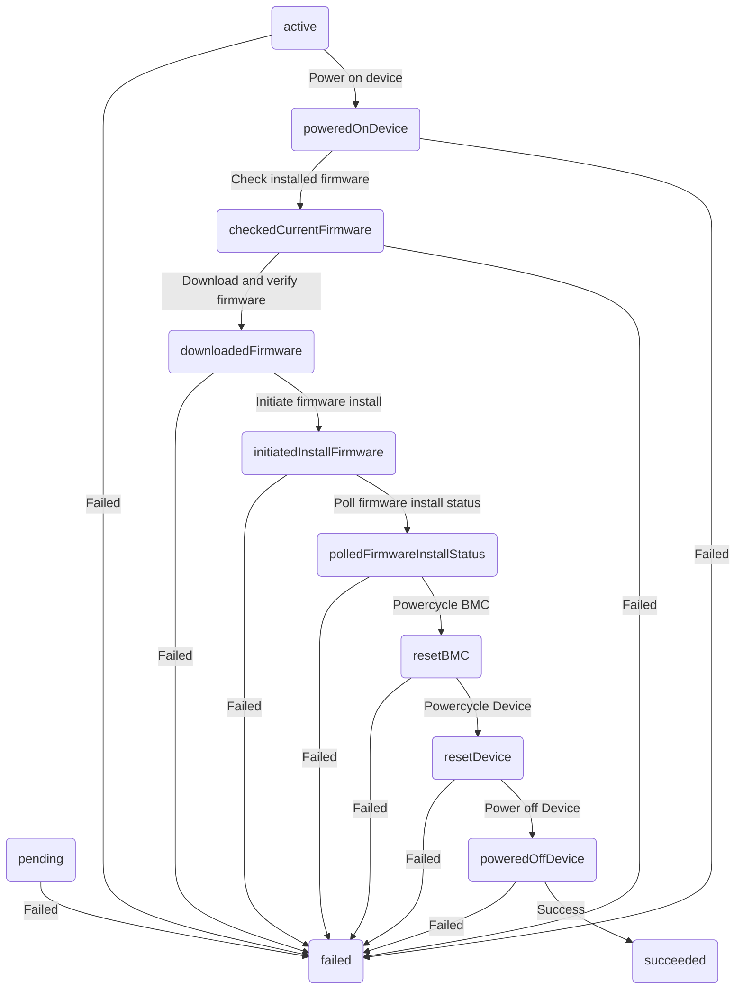
## Task Action (sub-statemachine) transitions
 
## Table of Contents

### States
* [checkedCurrentFirmware](#checkedcurrentfirmware)
* [downloadedFirmware](#downloadedfirmware)
* [Initial](#initial)
* [initiatedInstallFirmware](#initiatedinstallfirmware)
* [polledFirmwareInstallStatus](#polledfirmwareinstallstatus)
* [poweredOffDevice](#poweredoffdevice)
* [poweredOnDevice](#poweredondevice)
* [resetBMC](#resetbmc)
* [resetDevice](#resetdevice)

### Transition Types
Transition types are the events that can cause a state transition

* [checkingInstalledFirmware](#checkinginstalledfirmware)
* [downloadingFirmware](#downloadingfirmware)
* [initiatingInstallFirmware](#initiatinginstallfirmware)
* [pollingInstallStatus](#pollinginstallstatus)
* [poweringOffDevice](#poweringoffdevice)
* [poweringOnDevice](#poweringondevice)
* [resettingBMC](#resettingbmc)
* [resettingHost](#resettinghost)

### Transition Rules
Transition rules are the rules that define the required source states and conditions needed to move to a particular destination state when a particular transition type happens

* [Check installed firmware](#check-installed-firmware)
* [Download and verify firmware](#download-and-verify-firmware)
* [Failed](#failed)
* [Initiate firmware install](#initiate-firmware-install)
* [Poll firmware install status](#poll-firmware-install-status)
* [Power off Device](#power-off-device)
* [Power on device](#power-on-device)
* [Powercycle BMC](#powercycle-bmc)
* [Powercycle Device](#powercycle-device)
* [Success](#success)

## States
### checkedCurrentFirmware
This action state indicates the installed firmware on the component has been checked.

#### Transition types where this is the source state
* [downloadingFirmware](#downloadingfirmware)
* [null](#null)

#### Transition types where this is the destination state
* [checkingInstalledFirmware](#checkinginstalledfirmware)

#### Transition rules where this is the source state
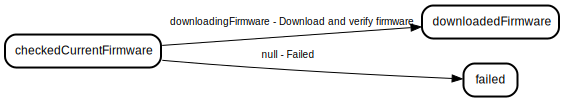

* [Download and verify firmware](#download-and-verify-firmware)
* [Failed](#failed)

#### Transition rules where this is the destination state
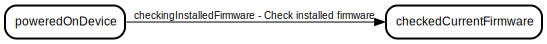

* [Check installed firmware](#check-installed-firmware)

### downloadedFirmware
This action state indicates the component firmware to be installed has been downloaded and verified.

#### Transition types where this is the source state
* [null](#null)
* [initiatingInstallFirmware](#initiatinginstallfirmware)

#### Transition types where this is the destination state
* [downloadingFirmware](#downloadingfirmware)

#### Transition rules where this is the source state
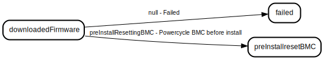

* [Failed](#failed)
* [Initiate firmware install](#initiate-firmware-install)

#### Transition rules where this is the destination state
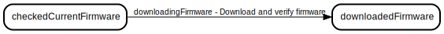

* [Download and verify firmware](#download-and-verify-firmware)

### Initial
The initial state of the state machine. This is a synthetic state that is not actually part of the state machine. It appears in documentation when transition rules hold a single source state that is an empty string

#### Transition types where this is the source state

#### Transition types where this is the destination state

#### Transition rules where this is the source state

#### Transition rules where this is the destination state

### initiatedInstallFirmware
This action state indicates the component firmware has been uploaded to the target device for install, and the firmware install on the device has been initiated.

#### Transition types where this is the source state
* [null](#null)
* [pollingInstallStatus](#pollinginstallstatus)

#### Transition types where this is the destination state
* [initiatingInstallFirmware](#initiatinginstallfirmware)

#### Transition rules where this is the source state
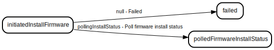

* [Failed](#failed)
* [Poll firmware install status](#poll-firmware-install-status)

#### Transition rules where this is the destination state
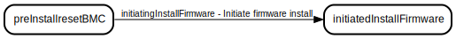

* [Initiate firmware install](#initiate-firmware-install)

### polledFirmwareInstallStatus
This action state indicates the component firmware install status is in a finalized state (powerCycleDevice, powerCycleBMC, successful, failed).

#### Transition types where this is the source state
* [null](#null)
* [resettingBMC](#resettingbmc)

#### Transition types where this is the destination state
* [pollingInstallStatus](#pollinginstallstatus)

#### Transition rules where this is the source state
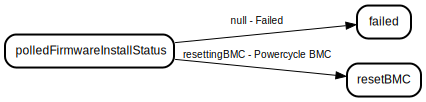

* [Failed](#failed)
* [Powercycle BMC](#powercycle-bmc)

#### Transition rules where this is the destination state
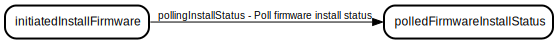

* [Poll firmware install status](#poll-firmware-install-status)

### poweredOffDevice
This action state indicates the Device has been (conditionally) power off to complete a component firmware install.

#### Transition types where this is the source state
* [null](#null)
* [null](#null)

#### Transition types where this is the destination state
* [poweringOffDevice](#poweringoffdevice)

#### Transition rules where this is the source state
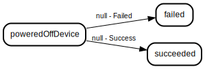

* [Failed](#failed)
* [Success](#success)

#### Transition rules where this is the destination state
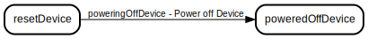

* [Power off Device](#power-off-device)

### poweredOnDevice
This action state indicates the device has been (conditionally) powered on for a component firmware install.

#### Transition types where this is the source state
* [checkingInstalledFirmware](#checkinginstalledfirmware)
* [null](#null)

#### Transition types where this is the destination state
* [poweringOnDevice](#poweringondevice)

#### Transition rules where this is the source state
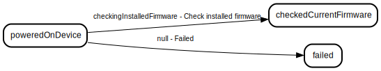

* [Check installed firmware](#check-installed-firmware)
* [Failed](#failed)

#### Transition rules where this is the destination state
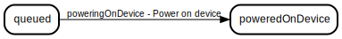

* [Power on device](#power-on-device)

### resetBMC
This action state indicates the BMC has been (conditionally) power cycled to complete a component firmware install.

#### Transition types where this is the source state
* [null](#null)
* [resettingHost](#resettinghost)

#### Transition types where this is the destination state
* [resettingBMC](#resettingbmc)

#### Transition rules where this is the source state
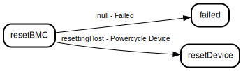

* [Failed](#failed)
* [Powercycle Device](#powercycle-device)

#### Transition rules where this is the destination state
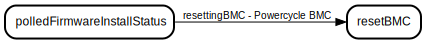

* [Powercycle BMC](#powercycle-bmc)

### resetDevice
This action state indicates the Device has been (conditionally) power cycled to complete a component firmware install.

#### Transition types where this is the source state
* [null](#null)
* [poweringOffDevice](#poweringoffdevice)

#### Transition types where this is the destination state
* [resettingHost](#resettinghost)

#### Transition rules where this is the source state
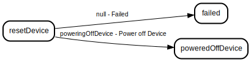

* [Failed](#failed)
* [Power off Device](#power-off-device)

#### Transition rules where this is the destination state
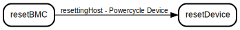

* [Powercycle Device](#powercycle-device)

## Transition Types
Transition types are the events that can cause a state transition

### checkingInstalledFirmware
In this action transition the installed component firmware is being checked.

#### Source states where this transition type applies
* [poweredOnDevice](#poweredondevice)

#### Destination states where this transition type applies
* [checkedCurrentFirmware](#checkedcurrentfirmware)
#### Transition rules using this transition type

* [Check installed firmware](#check-installed-firmware)
### downloadingFirmware
In this action transition the component firmware to be installed is being downloaded and verified.

#### Source states where this transition type applies
* [checkedCurrentFirmware](#checkedcurrentfirmware)

#### Destination states where this transition type applies
* [downloadedFirmware](#downloadedfirmware)
#### Transition rules using this transition type

* [Download and verify firmware](#download-and-verify-firmware)
### initiatingInstallFirmware
In this action transition the component firmware to be installed is being uploaded to the device and the component firmware install is being initated.

#### Source states where this transition type applies
* [downloadedFirmware](#downloadedfirmware)

#### Destination states where this transition type applies
* [initiatedInstallFirmware](#initiatedinstallfirmware)
#### Transition rules using this transition type

* [Initiate firmware install](#initiate-firmware-install)
### pollingInstallStatus
In this action transition the component firmware install status is being polled until its in a finalized state (powerCycleDevice, powerCycleBMC, successful, failed).

#### Source states where this transition type applies
* [initiatedInstallFirmware](#initiatedinstallfirmware)

#### Destination states where this transition type applies
* [polledFirmwareInstallStatus](#polledfirmwareinstallstatus)
#### Transition rules using this transition type

* [Poll firmware install status](#poll-firmware-install-status)
### poweringOffDevice
In this action transition the Device will be powered-off if the device was powered off when task started.

#### Source states where this transition type applies
* [resetDevice](#resetdevice)

#### Destination states where this transition type applies
* [poweredOffDevice](#poweredoffdevice)
#### Transition rules using this transition type
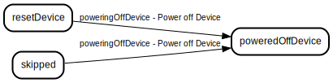

* [Power off Device](#power-off-device)
### poweringOnDevice
In this action transition the device is being powered on for a component firmware install - if it was powered-off.

#### Source states where this transition type applies
* [null](#null)

#### Destination states where this transition type applies
* [poweredOnDevice](#poweredondevice)
#### Transition rules using this transition type
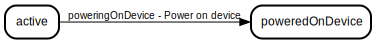

* [Power on device](#power-on-device)
### resettingBMC
In this action transition the BMC is being power-cycled - if the component firmware install status requires a BMC reset to proceed/complete.

#### Source states where this transition type applies
* [polledFirmwareInstallStatus](#polledfirmwareinstallstatus)

#### Destination states where this transition type applies
* [resetBMC](#resetbmc)
#### Transition rules using this transition type

* [Powercycle BMC](#powercycle-bmc)
### resettingHost
In this action transition the Device will be power-cycled if the component firmware install status requires a Device reset to proceed/complete.

#### Source states where this transition type applies
* [resetBMC](#resetbmc)

#### Destination states where this transition type applies
* [resetDevice](#resetdevice)
#### Transition rules using this transition type

* [Powercycle Device](#powercycle-device)

## Transition Rules
Transition rules are the rules that define the required source states and conditions needed to move to a particular destination state when a particular transition type happens

### Check installed firmware
Check firmware installed on component - if its equal - returns error, unless Task.Parameters.Force=true.

#### Source states
* [poweredOnDevice](#poweredondevice)

#### Destination state
[checkedCurrentFirmware](#checkedcurrentfirmware)

### Download and verify firmware
Download and verify firmware file checksum.

#### Source states
* [checkedCurrentFirmware](#checkedcurrentfirmware)

#### Destination state
[downloadedFirmware](#downloadedfirmware)

### Failed
Firmware install on component failed.

#### Source states
* [null](#null)
* [null](#null)
* [poweredOnDevice](#poweredondevice)
* [checkedCurrentFirmware](#checkedcurrentfirmware)
* [downloadedFirmware](#downloadedfirmware)
* [initiatedInstallFirmware](#initiatedinstallfirmware)
* [polledFirmwareInstallStatus](#polledfirmwareinstallstatus)
* [resetBMC](#resetbmc)
* [resetDevice](#resetdevice)
* [poweredOffDevice](#poweredoffdevice)

#### Destination state
[null](#null)

### Initiate firmware install
Initiate firmware install for component.

#### Source states
* [downloadedFirmware](#downloadedfirmware)

#### Destination state
[initiatedInstallFirmware](#initiatedinstallfirmware)

### Poll firmware install status
Poll BMC with exponential backoff for firmware install status until firmware install status is in a finalized state (completed/powercyclehost/powercyclebmc/failed).

#### Source states
* [initiatedInstallFirmware](#initiatedinstallfirmware)

#### Destination state
[polledFirmwareInstallStatus](#polledfirmwareinstallstatus)

### Power off Device
Powercycle Device - only if this is the final firmware (action statemachine) to be installed and the device was powered off earlier.

#### Source states
* [resetDevice](#resetdevice)

#### Destination state
[poweredOffDevice](#poweredoffdevice)

### Power on device
Power on device - if its currently powered off.

#### Source states
* [null](#null)

#### Destination state
[poweredOnDevice](#poweredondevice)

### Powercycle BMC
Powercycle BMC - only when pollFirmwareInstallStatus() identifies a BMC reset is required.

#### Source states
* [polledFirmwareInstallStatus](#polledfirmwareinstallstatus)

#### Destination state
[resetBMC](#resetbmc)

### Powercycle Device
Powercycle Device - only when pollFirmwareInstallStatus() identifies a Device power cycle is required.

#### Source states
* [resetBMC](#resetbmc)

#### Destination state
[resetDevice](#resetdevice)

### Success
Firmware install on component completed successfully.

#### Source states
* [poweredOffDevice](#poweredoffdevice)

#### Destination state
[null](#null)

