# Flasher task state machine
 
The Task statemachine plans and executes Actions (sub-statemachines) to install firmware.
 
Note: The Task statemachine plans and and executes [Action sub-state machine(s)](docs/statemachine/README-action-statemachine.md) for each firmware being installed.
 
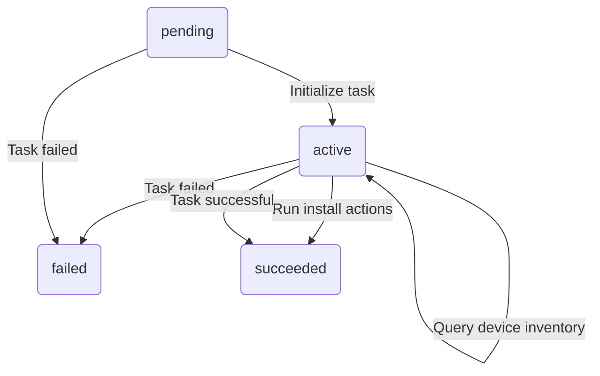
## Task statemachine transitions
 
## Table of Contents

### States
* [Active](#active)
* [Failed](#failed)
* [Initial](#initial)
* [Queued](#queued)
* [Success](#success)

### Transition Types
Transition types are the events that can cause a state transition

* [failed](#failed)
* [Plan](#plan)
* [Query](#query)
* [Run](#run)
* [succeeded](#succeeded)

### Transition Rules
Transition rules are the rules that define the required source states and conditions needed to move to a particular destination state when a particular transition type happens

* [Initialize task](#initialize-task)
* [Task failed](#task-failed)
* [Plan install actions](#plan-install-actions)
* [Query device inventory](#query-device-inventory)
* [Run install actions](#run-install-actions)
* [Task successful](#task-successful)

## States
### Active
In this state the task has been initialized and begun execution in the statemachine.

#### Transition types where this is the source state
* [failed](#failed)
* [Plan](#plan)
* [Query](#query)
* [Run](#run)
* [succeeded](#succeeded)

#### Transition types where this is the destination state
* [null](#null)
* [Plan](#plan)
* [Query](#query)

#### Transition rules where this is the source state
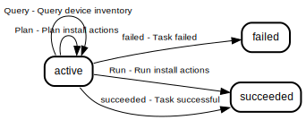

* [Plan install actions](#plan-install-actions)
* [Query device inventory](#query-device-inventory)
* [Run install actions](#run-install-actions)
* [Task failed](#task-failed)
* [Task successful](#task-successful)

#### Transition rules where this is the destination state
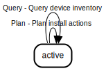

* [Initialize task](#initialize-task)
* [Plan install actions](#plan-install-actions)
* [Query device inventory](#query-device-inventory)

### Failed
In this state the task execution has failed.

#### Transition types where this is the source state

#### Transition types where this is the destination state
* [failed](#failed)

#### Transition rules where this is the source state
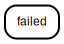

#### Transition rules where this is the destination state
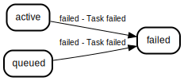

* [Task failed](#task-failed)

### Initial
The initial state of the state machine. This is a synthetic state that is not actually part of the state machine. It appears in documentation when transition rules hold a single source state that is an empty string

#### Transition types where this is the source state

#### Transition types where this is the destination state

#### Transition rules where this is the source state
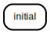

#### Transition rules where this is the destination state

### Queued
In this state the task is being initialized (this is done outside of the state machine).

#### Transition types where this is the source state
* [null](#null)
* [failed](#failed)

#### Transition types where this is the destination state

#### Transition rules where this is the source state
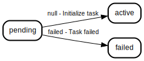

* [Initialize task](#initialize-task)
* [Task failed](#task-failed)

#### Transition rules where this is the destination state
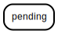

### Success
In this state the task execution has completed successfully.

#### Transition types where this is the source state

#### Transition types where this is the destination state
* [Run](#run)
* [succeeded](#succeeded)

#### Transition rules where this is the source state
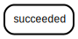

#### Transition rules where this is the destination state
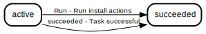

* [Run install actions](#run-install-actions)
* [Task successful](#task-successful)

## Transition Types
Transition types are the events that can cause a state transition

### failed
In this transition the task has failed and any post failure steps are being executed.

#### Source states where this transition type applies
* [Active](#active)
* [Queued](#queued)

#### Destination states where this transition type applies
* [Failed](#failed)
#### Transition rules using this transition type

* [Task failed](#task-failed)
### Plan
In this transition the actions (sub state machines) for the firmware install is being planned for execution.

#### Source states where this transition type applies
* [Active](#active)

#### Destination states where this transition type applies
* [Active](#active)
#### Transition rules using this transition type
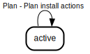

* [Plan install actions](#plan-install-actions)
### Query
In this transition the device component firmware information is being queried.

#### Source states where this transition type applies
* [Active](#active)

#### Destination states where this transition type applies
* [Active](#active)
#### Transition rules using this transition type
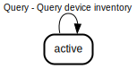

* [Query device inventory](#query-device-inventory)
### Run
In this transition the actions (sub state machines) for the firmware install are being executed.

#### Source states where this transition type applies
* [Active](#active)

#### Destination states where this transition type applies
* [Success](#success)
#### Transition rules using this transition type
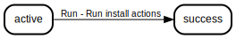

* [Run install actions](#run-install-actions)
### succeeded
In this transition the task has completed successfully and any post failure steps are being executed.

#### Source states where this transition type applies
* [Active](#active)

#### Destination states where this transition type applies
* [Success](#success)
#### Transition rules using this transition type
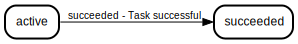

* [Task successful](#task-successful)

## Transition Rules
Transition rules are the rules that define the required source states and conditions needed to move to a particular destination state when a particular transition type happens

### Initialize task
Performs any task initialization, and transitions the state from pending to active.

#### Source states
* [Queued](#queued)

#### Destination state
[Active](#active)

### Task failed
Task execution has failed because of a failed task action or task handler.

#### Source states
* [Queued](#queued)
* [Active](#active)

#### Destination state
[Failed](#failed)

### Plan install actions
Prepare a plan - Action (sub) state machines for each firmware to be installed. Firmwares applicable is decided based on task parameters and by comparing the versions currently installed.

#### Source states
* [Active](#active)

#### Destination state
[Active](#active)

### Query device inventory
Query device inventory for component firmware versions - from the configured inventory source, fall back to querying inventory from the device.

#### Source states
* [Active](#active)

#### Destination state
[Active](#active)

### Run install actions
Run executes the planned Action (sub) state machines prepared in the Plan stage.

#### Source states
* [Active](#active)

#### Destination state
[Success](#success)

### Task successful
Task execution completed successfully.

#### Source states
* [Active](#active)

#### Destination state
[Success](#success)

