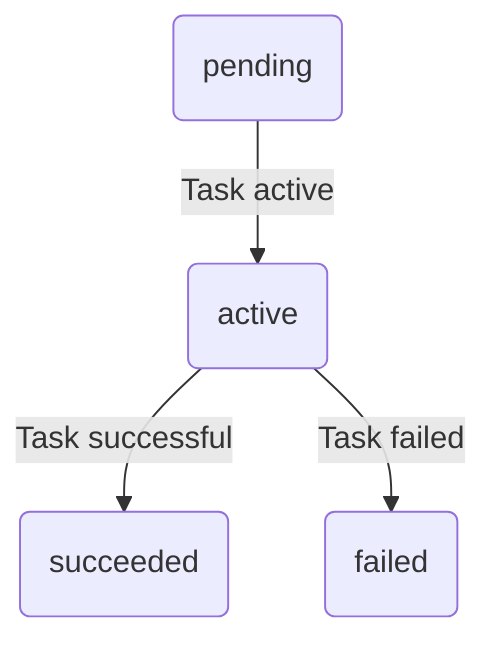

# Flasher task state machine
 
The Task statemachine plans and executes Actions (sub-statemachines) to install firmware.
 
Note: The Task statemachine plans and and executes [Action sub-state machine(s)](docs/statemachine/README-action-statemachine.md) for _each_ firmware being installed.
 

